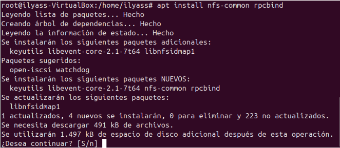

# Introducció

En aquest Sprint treballarem amb un Server i diferents Clients( windows, Ubuntu), En primer lloc,
Instal·larem el domini LDAP i el configurarem, després Gestionarem el domini, Entorns grafics i finalment treballarem amb servidors SMB i nfs.

## Instal·lació domini LDAP

Per a fer la instal·lació d'un domini LDAP hem de configurar un servidor que ens servira 
com a directori per getionar l'autenticació i autorització d'usuaris i recursos en una xarxa.

Tenim dos formes de afegir el nostre domini una es en els arxius que descaragarem i la altra es la següent que es per la comanda reconfigure.
En primer lloc Posem Xarxa NAT per poder tener connexió i que els clients puguin connectar-se.

Posem una ip estatica.

Ho comprovem fents diferents pings.

Nem a l'ubicació següent i cambiem el nostre hostname en el meu cas ho he deixat per defecte.

Nem al arxiu Hosts i agreguem la nostra ip i el nostre domini que afegerim proximament.

Ara descarguem el paquet de LDAP

Fem uh dpkg-recongure slapd 

Posem que no volem omitir la conf.

Posem el nostre domini

Ara el nom de l'organització

Posem la contrasenya i la confirmem.

Posem la opcio SÍ.Posem a guaradar la nova configuració.

Posem la opcio SÍ.Posem a guaradar la nova configuració. 

Ara per comprovar les dades farem seguidament la comanda slapcat.

Nem al moodle i descarguem una carepta on tenim diferents arxius.
Ara accedir amb la comanda nano al arxiu uo.ldif i cambiem per a les nostres dades com el domini. 

Ara nem al arxiu grup.ldif i fem quasi les mateixes configuracions. 

Ens inisirim en el usu.ldif i fem diferents configuracions d'usuaris.

Ara fem un ldapadd i afegim les configuracions que hem fet anteriorment, es te que dir esta es la segona opció de com afegir el nostre domini. Si tornem a fer un slapcat podem veure els canvis fets.

Si tornem a fer un slapcat podem veure els canvis fets.

## Unir equips al domini

Ara nem a unir el nostre primer client.
En primer lloc instal·lem ambla següent comanda, Al finalitzar la següent comanda sens obrira la següent finetra.

Si per algun cas al instal·lar el anterior apt i hem saltat la configuració posem la següent comanda per poder configurar el LDAP.
Pisem que volem congifurar el LDAP.

Posem la ip del nostre servidor i acceptar.

Posem el nostre domini que hem posat anteriorment al fer la instal·lació en el SERVIDOR.

Posem la versio 3.

Cliquem la opcio Sí.

Cliquem la opcio Sí.

Posem admin per tener permisos de admin.

Ara posem la contrasenya que hem posat al SERVIDOR i la tornem a posar per confirmar.

Tornem a posar els priviligis que tindrem.

Posem md5 que es per encriptar la contrasenyar.

Nem al arxiu /etc/nsswitch.conf  i fiquem exactament com es mostra en la imatge següent.

Ara nem al arxiu /etc/pam.d/common-session i posem la comanda que esta en el requadre roig.

Cambiem les següents en el fitxer 50-Ubuntu.conf.

Ara fem un use alu 1 i accedim al alu1 desde codi i fem un whoami per veure els privilegis que tenim i veem que tenim de alu1.

## Gestió de domini

Per gestionar utlitzarem diferents comandes de ldap.

Fem un rconfigure per esborrar altres usuaris o grups creats anteriorment.

Ara agafaem un fitxer i agreguem dades que vulguem amb la seva ou i etc...

Fem la següent comanda per afegir els usuaris que tenim al fitxer .ldif i posem la contra que hem dir anteriorment.

Fem un slapcat i podem observar els usuaris que hem dit anteriorment.

Ara podem utilitzar aquesta comanda per poder fer una busqueda.

També podem utilitzar diferents filtres per fer unes bones busquedes com ara farem pel seu mail.

També podem utilitzar pel filtre groups

Ara podem utilitzar la comanda ldapmodify. Primer crearem un document que es dira proves.ldif i aqui podrem posar totes les modificacións que farem.

I farem esta comanda per fer la modificació. Podrem observar que ens posant que se esta modificant.

Ara en ves de utilitzar la comanda ldapdelete utilitzem la de ldapmodify i al arxiu posem en el lloc de type posem delete aixi podem esborrar els usuaris.

Ara tornem a fer la comanda anterior i podem observar que esta borrant al usuari.

Ara fem una altra modificació afegint un mail a un usuari especific.

I realitzem la comanda i fem un search.

Ara farem una altra modificació de tipo modrdn i cambiarem el cn a MiguelAngel.

Tornem a fer la comanda ldapmodify i al fer un search podem observar que el cambi ha funcionat correctament.

## Entorns gràfics

Per utilitzar Entorns grafics utilitzarem el programa Apache Directory Studio i seguirem els següents pasos:

En primer lloc accedim a la pagina oficial de Apache Directory i instal·lem el programam per a linux.
 

Es possible que que ens faigue instal·lar el java, jo en el meu cas ja el tinc instal·lat. Accedim a la part superior en `LDAP`
 

Posem nova connexió.
 

Posem un nom a la connexió i la ip del server, i virifiquem la connectivitat.
 

Ara posem el nostre domini i posem a verificar en aquest cas surt que ja esta verificat.

Ara agregarem un usuari per provar si funciona realment.

Entrarem al nostre domini i fem oin posa `New Entry`.
 

Posem que utilitzem un esquema existent.
 

Posem els següents objectes que voldrem afegir.
 

Agreguem les dades del nou usuari.
 

Agreguem les següents dades i posem a finalitzar.
 

Aqui ja podem veure que ja esta creat
 

Ara es poder accedir amb l'usuari creat pero no he pogut.

## Servidors SMB 

### INSTAL·LACIÓ I CONFIGURACIÓ SERVER

En primer lloc, en la maquina server utilitzem la següent comanda per instal·lar samba.
 

Creem els següent directori que voldrem compartir amb els permisos necessaris. 

En el arxiu `etc/samba/smb.conf` afegim les següents dades per a que els clients puguin tenir permiso en la carpeta que compartirem.

Sempre que fem algún canvi en aquest arxiu estem obligats (Si volem que funcion) a fer la següent comanda `systemctl restart smbd nmbd`

Utilitzem aquest acomanda per crear els usuaris que puguin accedir a la carpeta.
Seguirem la següent comanda per crear usuaris i grups.

Le posem una contrasenya amb la comanda `smbpasswd -a "blau"`, aquesta contrasenya la necessitarem al voler accedir a la carpeta.

Ara tornem a l'arxiu `etc/samba/smb.conf` i fem els següents canvis, Principalment son els permisos que lis hi donem als usuaris.

### INSTAL·LACIÓ  I PROVES CLIENT

En el client ubuntu fem la instal·lació del smbclient.

Nem a Fitxers, altres ubicacions, i a la barra de baix posem la següent URL: `smb://10.0.2.15/proves` i posem connectar. 

Posem per provar si podem accedir amb permisos d'anonim.

Amb les modificacions que tenim en el fitxer `etc/samba/smb.conf` no seria possible crear o fer modificacions amb els permisos de anonim.

Per arreglar aquest error posem el `read only = yes` en comentaris.

Com he dit abans hem de fer un restart al smbd nmbd

I ara finalment podem crear una carpeta anominada anonim.

Ara provem de entrar amb el usuari blau i la contrasenya que vam posar al crear.

Creem una carpeta per probar si podem crear i com se pot veure hem creat la carpeta anominda blau.

Nem al servidor i podem veure que se han correctament i amb els permisos del seu creador.

Ara porobem en roig i com antes en el fitxer `etc/samba/smb.conf` hem posat que denegem el acces al usuari roig.

Ara probem amb l'usuari groc.

Podem accedir pero nomes podem llegir

No podem crear ni esborrar.

## Servidors NFS

Per a compartir fitxers en NFS en el Servidor hem de instal·lar el nfs-kernel-server.

Fem un `systemctl status nfs-srever` per veure el estat.

### Instal·lació pasrt client ubuntu
Ara nem al client ubutnu i fem la següent comanda per instal·lar 

### Instal·lació pasrt client windows

Per fer la instal·lació en windows necesitem fer diferent pasos per poder activar-ho.
En primer lloc nem al `Programes i caracteristiques`:

A la part esquerra i cliquem sobre `Activar o desactivar las caracteristicas de Windows`:

Ens ubiquem   a la caracteristica de `Servicios para NFS`.

I posem acceptar i se ens actualitzara.

### Compartició carpeta al server i proves en el serverç

Creem la carpeta que volem compartir.

Li assignem els permisos a la carpeta i ho comprovem.

En el arxiu `/etc/exports` afegim el següent codi.

I reiniciem el nfs-kernel-server

Ara nem al client windows i entrem dins de la ip del server 

Com podem veure ja estem dins de la carpeta i creem un arxiu.txt.

Si entrem al server i fem un ls, podem veure que se ha creat.

Si posem en acces directe, cada vegada que iniciem sissió podrem accedir a la carpeta.

Ara accedim al client ubuntu.

Accedim al directori /mnt i creem una carpeta nfs i li assignem permisos adients.
Proximament muntem la carpeta amb la IP del Server i al fer la comanda `df -h` podrem veure el que hem fet.

accedim a /nfs i creem el arxiu `aaaa` 

Accedim al Server i  fem un ls - l podem veure el arxiu creat.

### Perfils mobils (Ubuntu LDAP)

Ara realitzarem els perfils mobils amb el client Ubunt.

Anirem a l'arrel on crearem la carpeta perfils amb els següents permissos.

Accedirem al arxiu `/etc/exports` i afegirem el següent codi.

Fem un reinici del `nfs-kernel-server`

Accedirem al arxiu `usu.ldif` i modifiquem els següents parametres, que basicament son el nom del usuari, on es creara el home del usuari (Quan accedim) i la contrasenya.

Realitzem el `ldapadd` del usuari que hem modificat anteriorment

Accedim al `/etc/fstab` i agreguem el següent codi.

Cal afegir que la correció que vam parlar que fariem ja esta feta pero no hem tingut resultats ja que la mquina(client) hem petaba.

