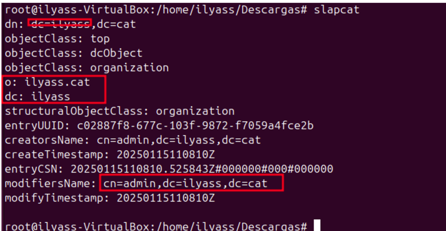

# Introducció

En aquest Sprint treballarem amb un Server i diferents Clients( windows, Ubuntu), En primer lloc,
Instal·larem el domini LDAP i el configurarem, després Gestionarem el domini, Entorns grafics i finalment treballarem amb servidors SMB i nfs.

## Instal·lació domini LDAP

Per a fer la instal·lació d'un domini LDAP hem de configurar un servidor que ens servira 
com a directori per getionar l'autenticació i autorització d'usuaris i recursos en una xarxa.

Tenim dos formes de afegir el nostre domini una es en els arxius que descaragarem i la altra es la següent que es per la comanda reconfigure.
En primer lloc Posem Xarxa NAT per poder tener connexió i que els clients puguin connectar-se.

Posem una ip estatica.

Ho comprovem fents diferents pings.

Nem a l'ubicació següent i cambiem el nostre hostname en el meu cas ho he deixat per defecte.

Nem al arxiu Hosts i agreguem la nostra ip i el nostre domini que afegerim proximament.

Ara descarguem el paquet de LDAP

Fem uh dpkg-recongure slapd 

Posem que no volem omitir la conf.

Posem el nostre domini

Ara el nom de l'organització

Posem la contrasenya i la confirmem.

Posem la opcio SÍ.Posem a guaradar la nova configuració.

Posem la opcio SÍ.Posem a guaradar la nova configuració. 

Ara per comprovar les dades farem seguidament la comanda slapcat.

Nem al moodle i descarguem una carepta on tenim diferents arxius.
Ara accedir amb la comanda nano al arxiu uo.ldif i cambiem per a les nostres dades com el domini. 

Ara nem al arxiu grup.ldif i fem quasi les mateixes configuracions. 

Ens inisirim en el usu.ldif i fem diferents configuracions d'usuaris.

Ara fem un ldapadd i afegim les configuracions que hem fet anteriorment, es te que dir esta es la segona opció de com afegir el nostre domini. Si tornem a fer un slapcat podem veure els canvis fets.

Si tornem a fer un slapcat podem veure els canvis fets.

## Unir equips al domini

Ara nem a unir el nostre primer client.
En primer lloc instal·lem ambla següent comanda, Al finalitzar la següent comanda sens obrira la següent finetra.

Si per algun cas al instal·lar el anterior apt i hem saltat la configuració posem la següent comanda per poder configurar el LDAP.
Pisem que volem congifurar el LDAP.

Posem la ip del nostre servidor i acceptar.

Posem el nostre domini que hem posat anteriorment al fer la instal·lació en el SERVIDOR.

Posem la versio 3.

Cliquem la opcio Sí.

Cliquem la opcio Sí.

Posem admin per tener permisos de admin.

Ara posem la contrasenya que hem posat al SERVIDOR i la tornem a posar per confirmar.

Tornem a posar els priviligis que tindrem.

Posem md5 que es per encriptar la contrasenyar.

Nem al arxiu /etc/nsswitch.conf  i fiquem exactament com es mostra en la imatge següent.

Ara nem al arxiu /etc/pam.d/common-session i posem la comanda que esta en el requadre roig.

Cambiem les següents en el fitxer 50-Ubuntu.conf.

Ara fem un use alu 1 i accedim al alu1 desde codi i fem un whoami per veure els privilegis que tenim i veem que tenim de alu1.

## Gestió de domini

Per gestionar utlitzarem diferents comandes de ldap.

Fem un rconfigure per esborrar altres usuaris o grups creats anteriorment.

Ara agafaem un fitxer i agreguem dades que vulguem amb la seva ou i etc...

Fem la següent comanda per afegir els usuaris que tenim al fitxer .ldif i posem la contra que hem dir anteriorment.

Fem un slapcat i podem observar els usuaris que hem dit anteriorment.

Ara podem utilitzar aquesta comanda per poder fer una busqueda.

També podem utilitzar diferents filtres per fer unes bones busquedes com ara farem pel seu mail.

També podem utilitzar pel filtre groups

Ara podem utilitzar la comanda ldapmodify. Primer crearem un document que es dira proves.ldif i aqui podrem posar totes les modificacións que farem.

I farem esta comanda per fer la modificació. Podrem observar que ens posant que se esta modificant.

Ara en ves de utilitzar la comanda ldapdelete utilitzem la de ldapmodify i al arxiu posem en el lloc de type posem delete aixi podem esborrar els usuaris.

Ara tornem a fer la comanda anterior i podem observar que esta borrant al usuari.

Ara fem una altra modificació afegint un mail a un usuari especific.

I realitzem la comanda i fem un search.

Ara farem una altra modificació de tipo modrdn i cambiarem el cn a MiguelAngel.

Tornem a fer la comanda ldapmodify i al fer un search podem observar que el cambi ha funcionat correctament.

## Entorns gràfics
## Servidors SMB 
## Servidors NFS
