# RAIDS (Sistemes d’emmagatzematge)

Els RAID serveixen per millorar la seguretat i el rendiment de l’emmagatzematge mitjançant la combinació de diversos discos. Aquests sistemes ofereixen diferents nivells de redundància i velocitat segons la configuració escollida.

## Tipus de RAID

**RAID 0**: Utilitza almenys dos discos i distribueix les dades entre ells per millorar el rendiment. No proporciona redundància: si un disc falla, es perden totes les dades.

**RAID 1**: Consta de dos discos en mirall, on la informació es copia automàticament d’un a l’altre. Ofereix alta seguretat però redueix la capacitat efectiva a la meitat.

**RAID 5**: Necessita almenys tres discos. Distribueix les dades i la informació de paritat entre tots els discos, permetent recuperar les dades en cas de fallada d’un disc. Equilibra seguretat i rendiment.

**RAID 6**: Similar al RAID 5, però amb un nivell addicional de paritat. Requereix un mínim de quatre discos i pot suportar la fallada de dos discos sense pèrdua de dades.

**Per què és millor fer volums?**
Els volums lògics permeten una gestió més flexible de l’espai d’emmagatzematge, facilitant la redimensió i la reorganització de les dades sense necessitat de reformatejar o perdre informació.

## RAID 1
En primer lloc instal·lem el `mdadm`.
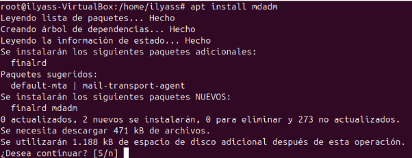  
Creem les particions del dos discos, primer del dis sdb.
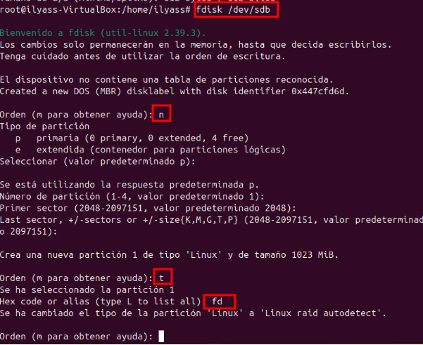  
Ar creem la partició en el disc sdc amb els següents parametres.
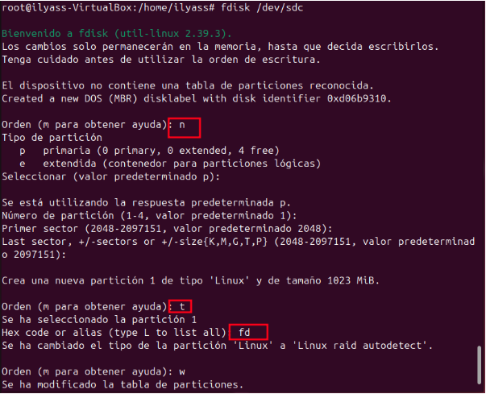  
Com podem observar al fer el `fdisk -l` podrem observar les particions que hem fet.
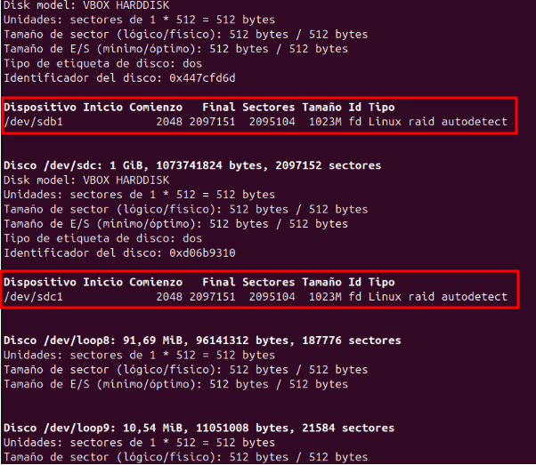  
Creem la carpeta raid1 i fem la següent comanda.
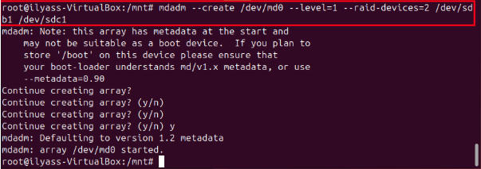  
Cambiem el format a `ext4`
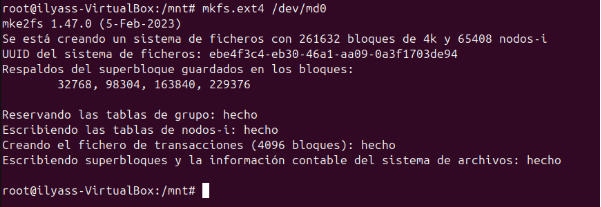  
Al fer la següent comanda podrem veure que se ha fet be el raid.
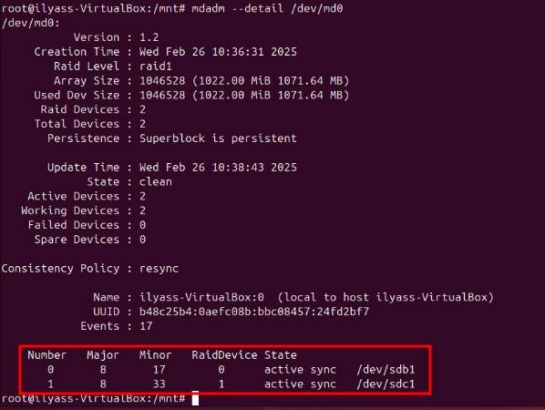  
Passem els que ens dona el scan al fitxer `/etc/mdadm/mdadm.conf`.
  
Seguidament modifiquem aquest fitxer i agreguem el següent codi.
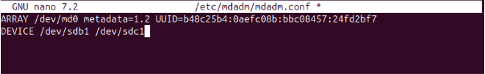  
En el arxiu `/etc/fstab` agreguem el ultim codi.
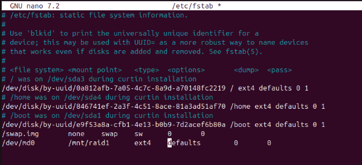  
Abans de fer un reboot muntem el disc i fem reinicici dels serveis.
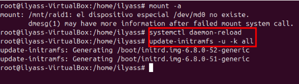  
Ya ho tenim tot preparat per fer proves.
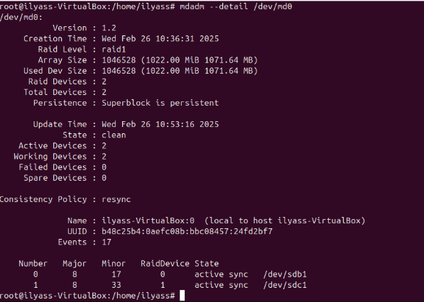  
Com ha primera prova crearem dos fitxers i ho posarem dins del raid.
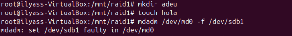  
Borrem un el disc i al fer la comanda per veure els detalls veurem que esta borrada. 
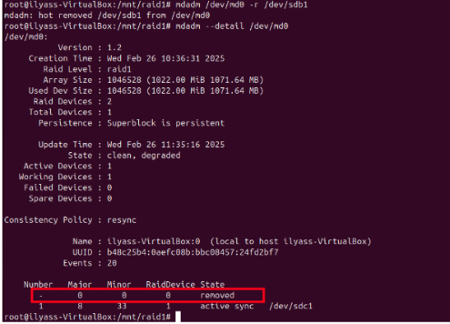  
Ara ens posarem a esborrar el raid amb les següents comandes.
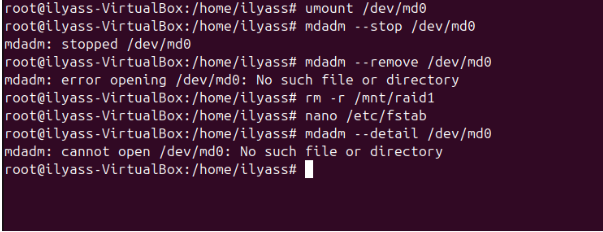  
com podem veure no ho podem borrar facilment, i utilitzarem la comanda de `zero-superblock`.
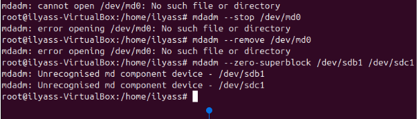  
Com podem observar ja no tenim el raid.
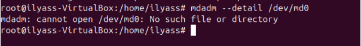  

## RAID 5
En primer lloc creem 4 discos per fer el RAID 5.
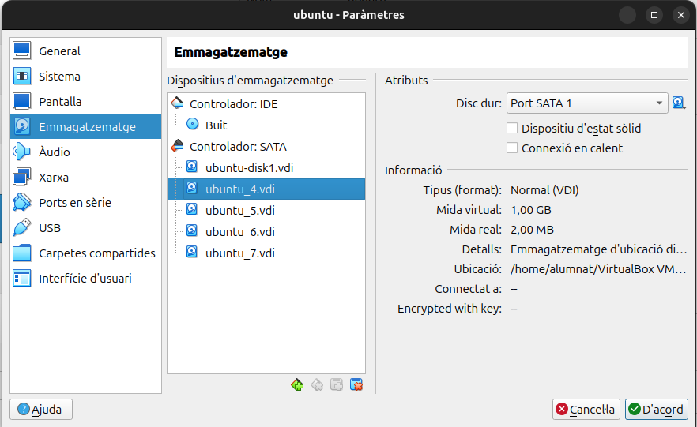
Podem observar el 4 discos que hem afegit.
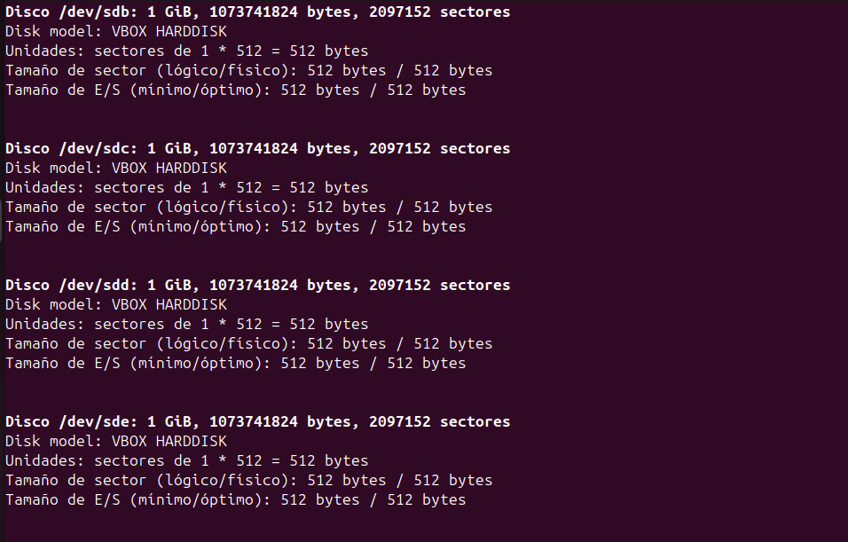

Aquest pas ho hem de fer amb els 4 discos.
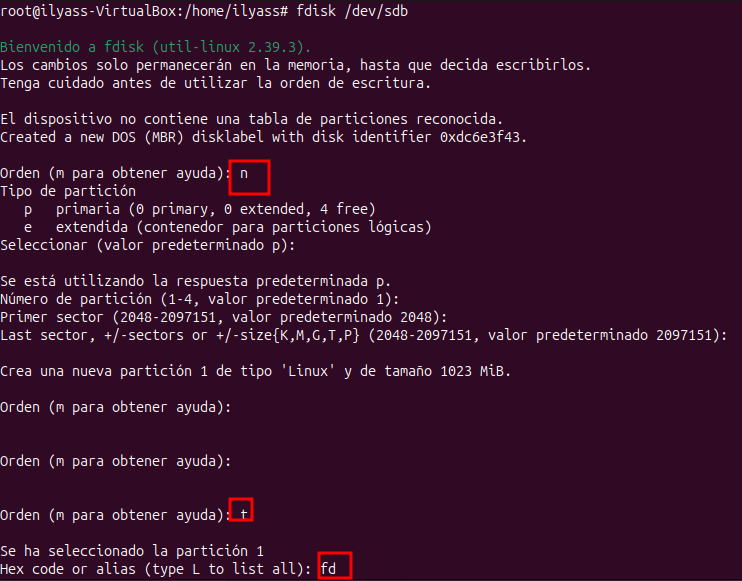

Compodem observar el pas anterior ens ha funconat correctament.
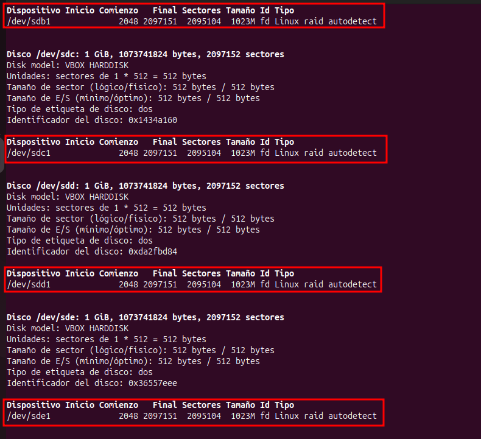

Creem la carpeta que la anomenarem raid 5 i assignarem els permissos següents.
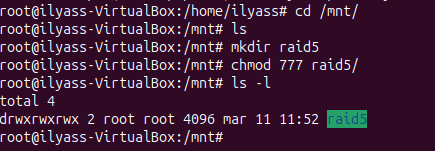

Ara creem el Raid amb la següent comanda.
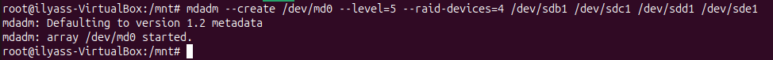

Ara posem el format `ext4`
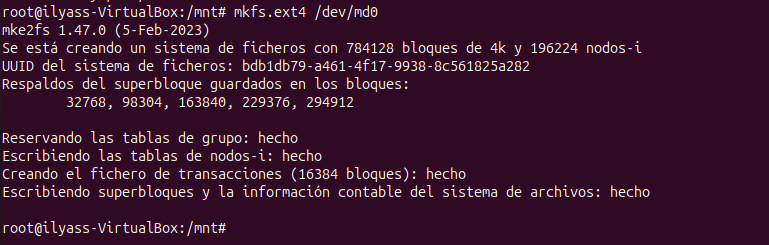

Ara fem la comanda següent que mou tot lo de detalls al fitxer següent.

En el fitxer agreguem les següent dades.
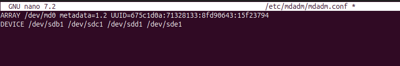

En el fitxer `/etc/fstab` agregem el que esta subratllat a la següent imatge.
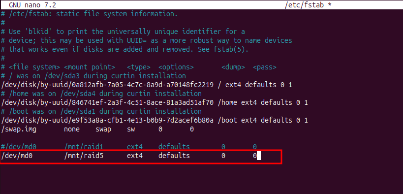

Com podem veure al fer la següen comanda podem observar que tenim els 4 discos activats.
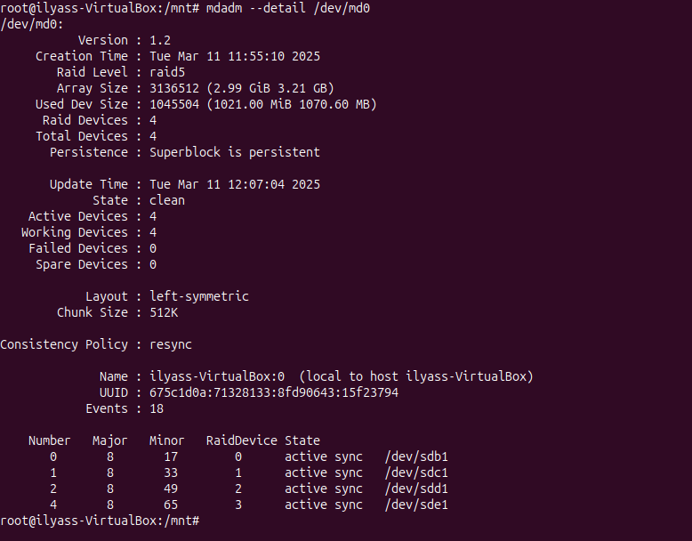

Ara ens disposem a fer proves:
Creem arxius per poder fer proves amb funcionabilitat del raid
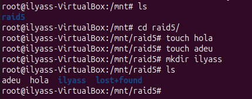

Desactivem un disc i comprovem si encara tenim la informació i comprovem que encara tenim la informació.
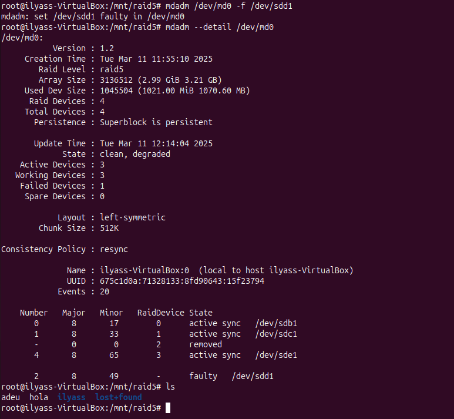

Seguiren fent proves fins que ens surtigue error i podem comprovar que el raid no pot funcionar solament amb dos discos.
Igualment ens el descativa pero el sistema ens dona una alerta.
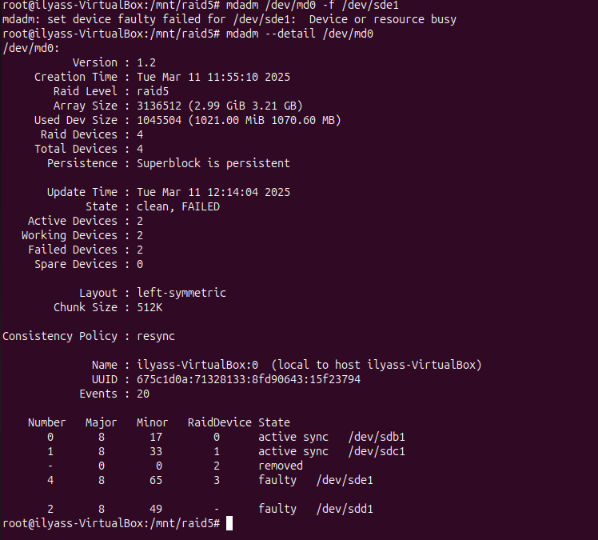

Creem un nou disc per pasar la informació a aquest.

Amb la següent comanda traspassem les dades dels discs anteriors a aquest.
En el meu cas em dona un problema de superblock.
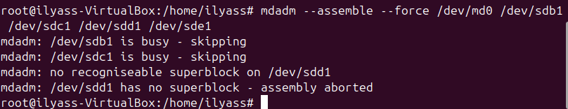

Al fer els detalls podem observar que no tenim el raid ja que segurament se me ha petat.
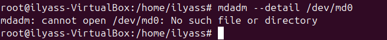

Ara finalmet esborrem el RAID 5, com anteriorment he borrat els dos discos manualment se ha petat i al esborrar el raid nomes se me han borrat 2 discos.
 