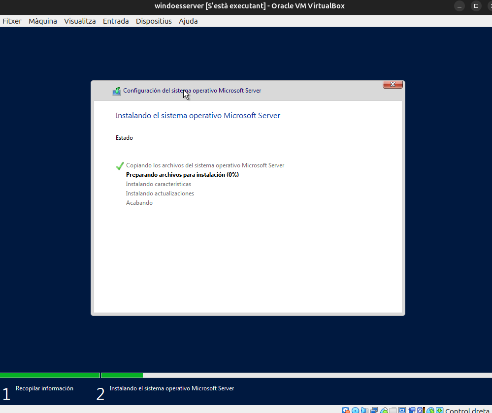
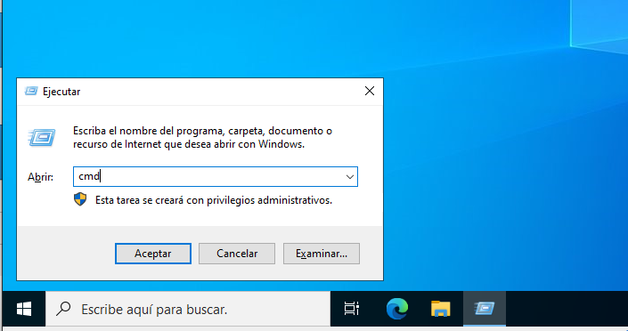

# instal·lació i configuració inicial

## Instal·lació SO (Windows server)

En primer lloc instal·larem la iso que la podrem trobar en el seguent enllaç:

https://software-static.download.prss.microsoft.com/sg/download/888969d5-f34g-4e03-ac9d-1f9786c66749/SERVER_EVAL_x64FRE_es-es.iso

I creem la nova maquina amb la iso.

 

Procedim a la configuració de la maquina.
 

I installarem el servidor de Windows Server.
 

Seleccionarem el sistema operatiu que volem instalar.
 

Posem la instal·lació de personalització ja que podem seleccionar la partició on volem instal·lar el sistema operatiu.
 

Selccionem la partició.

I esperem fins que s'instal·li el sistema operatiu.
 

Al finalitzar la instal·lació, gestionarem la constrasenya de l'administrador del sistema operatiu.
 

Finalemt ja el tenim instal·lat. 
Accedim:
 

## Xarxa bàsica

Per configurar la xarxa estàtica hem de fer els seguents passos:

Accedim al menú de configuració.
 

Cliquem l'opció de cambiar opcions de red.
 

Al protocol de ipv4 seleccionem propietats.
 

I utilitzem la següent configuració d'IP.
 

Per accedir al terminal de windows fem la combinació de tecles Win + R i escribim: cmd.
 

Finalment realitzxem la següent comanda per poder visualitzar la ip del servidor. 
 

## Instal·lació SO (Windows 10)

Creem la nova maquina virtual i seleccionem la opció de windows 10.
 

Seleccionem l'idioma.
 

I instal·lem el sistema operatiu.
 

Acceptem els termes i condiciones..
 

Seleccionem l'opció personalitzada.

Seleccionem la partició.
 

I espirem fins que s'instal·li el sistema operatiu.
  

Rellenem amb el nostre nom.
  

I podem observar que s'ha finalitzar la instal·lació i ja podeu entrar al sistema operatiu.
  

## Punts de restauració

Accedim al panel de control de windows.
 

Accedim a la ruta en el panel de control. I accedim a la part esquerra i nem a l'opció de protecció  del sistema.
  

Com podem observar en surt que aquesta opció esta desactivada per defecte pero nosaltres com volem fer proves l'activarem.
  

Seguidament posem en crear i haurem de posar un nom al punt de restauració que he posat la data d'avui.
  

## VIRTUALITZACIÓ
En el buscador de windows volem buscar "Caracteristicas de windows".  

I busquem l'opció de Hyper-V
 

La seleccionem i acceptem els canvis.
  

I com podem veure ja tenim activat el Hyper-V.
  

## GESTOR DE ARRENCADA (WINDOWS I UBUNTU)

En primer lloc en el següent programa creem una particio per poder instal·lar Ubuntu.
Cal configurar amb els següents parametres:
 

Com podem observar tenim una partició que no esta assignada.
 

Procedirem a configurar la partició.
 

 

Coloquem el tamany de la partició.
 

Li assignem una lletra.
 

I formateijem ambs les següents configuracions.
 

Seguidament reiniciem i abanas de que inicie el windows cilquem la tecla `F12` i la lletra c.
 

Seleccionem la primera opció
 

I fem els pasos per instal·lar Ubuntu.
 

En aquest apartat seleccionem que volem instal·lar Ubuntu amb windows.
 

 

I instal·lem.
 

Cal recordar que es important tenir bona memoria base i tenir al menys 4 nuclis.
 

 

Finalment ja tenim instal·lat Ubuntu i Reiniciem.
 

Al reiniciar podem observar que podem entrar amb ubuntu i windows.
 

Com podem observar tenim el meu usuari de ubuntu.
 

## COMANDES GENERALS
Accedim al terminal.
  

La primera comanda que utilitzare es `dir` que mostra tots els fitxers i directoris de la carpeta actual.
  

La següent comanda es `cls` que es per limpiar el terminal.
  

La següent comanda es `cd` que es per entrar a un directori.
  

La següent comanda es `mkdir` que es per crear un directori i també `rmdir` que es per eliminar un directori.  
  

## Instal·lació aplicacions.

Per instal·lar apicacions necessitem instal·lar arxius `exe` que són aplicacions.  
En aquest cas nem a la pagina de Mozilla que tenim la pagina de instal·lació de aplicacions.
  

I executem el paquet d'instal·lació.
  

Seguim les instruccions fins descarregar l¡aplicació
 

Finalement ja podem executar l'aplicació.
  

