# Instal·lació, Configuració de Programari de Base i Gestió de Fitxers

## Gestió de Processos

Per poder visualitzar el processos tenim doos maneres que serien en cmd o en part grafica.

La primera és a través de la comanda `tasklist` que mostra els processos en execució.
 

Per matar un processos s'usa la comanda `taskkill` amb el nom del processos que volem matar.
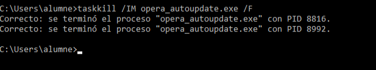 

També podem guardar els processos dins d'un arxiu i es fa de la següent forma.
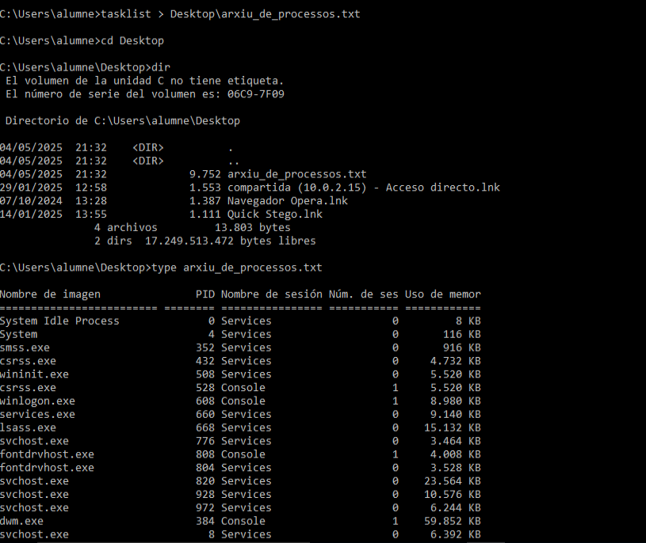

La següent forma es visualitzar els processos de forma gràfica fent botó dret al escriptori i en administraciío de tarees i mes detalls i podriem veure els processos i tot el que comporta.

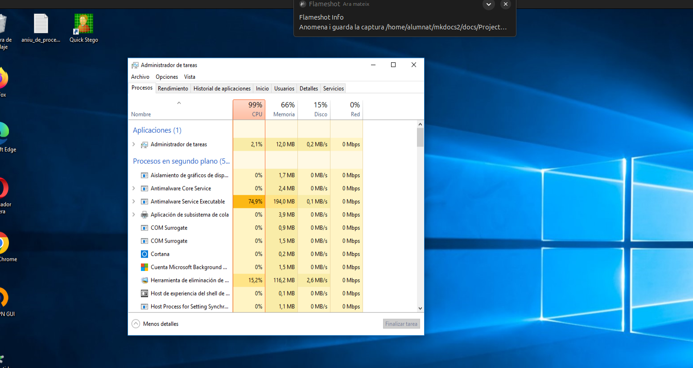

## Gestió d'usuaris, grups i permisos 

### Usuaris i grups
Per poder gestionar usuaris graficament utilitzem el programa `lusrmgr.msc` que es troba a la carpeta de programari de Windows.

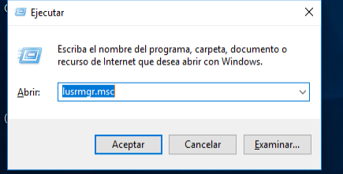

Accedim a usuaris i per crear es realitzen els següents passos.

Creem el primer usuari `ilyass` amb la seva contraseña.
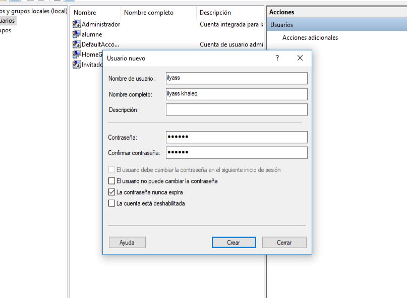

creem el segon usuari `juan` amb la seva contraseña.
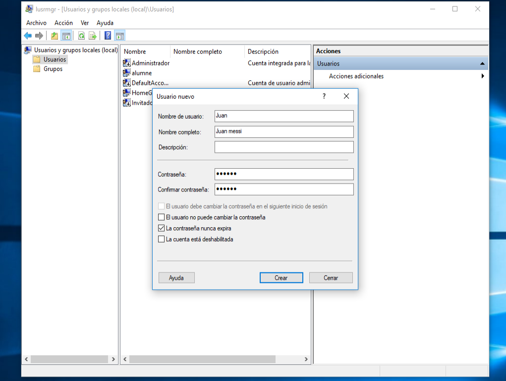

Com podem observar s'han creat correctament.
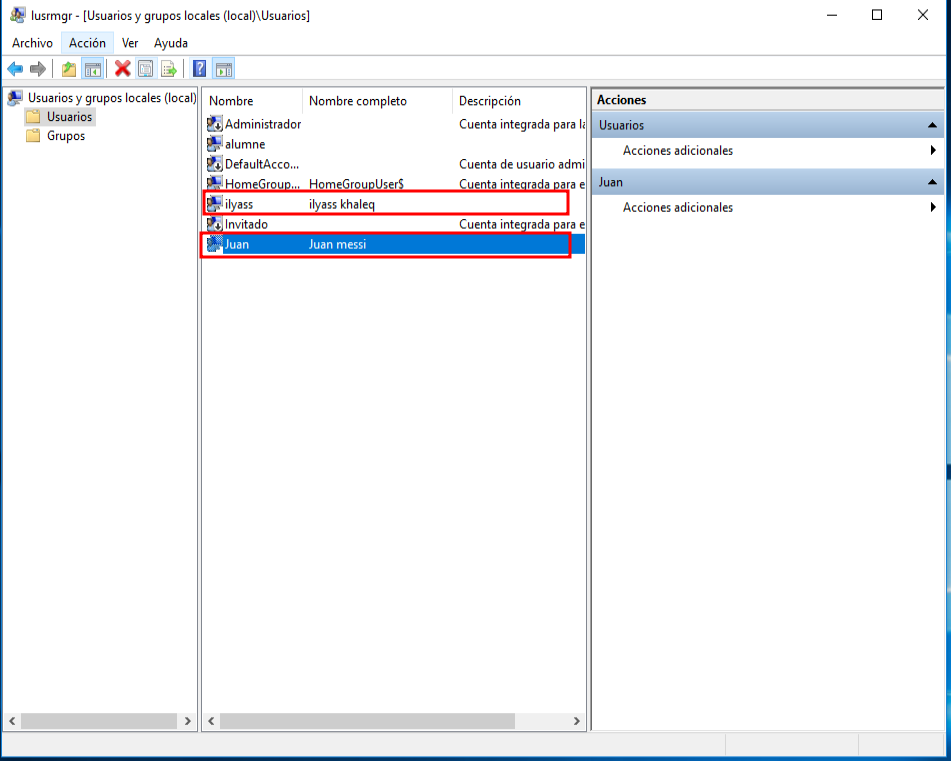

Ara ens posarem a crear un grup de usuaris que simulariem els usuaris del institut.
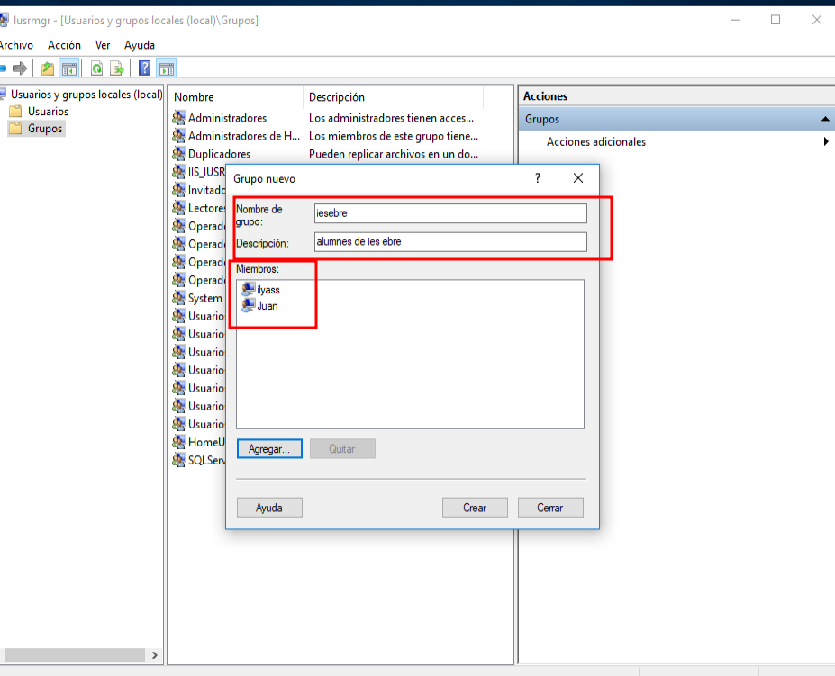

Com podem observar s'han creat correctament.
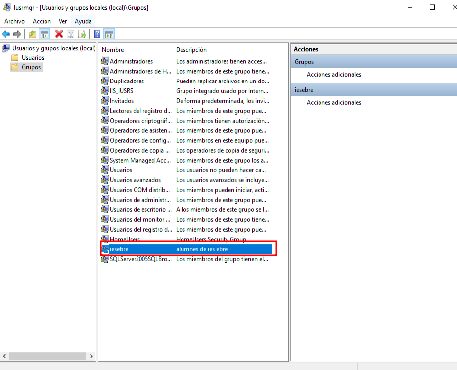

Ara comprovem que podem accedir als usuaris.

Com podem observar hem accedim correctament als usuaris creats.
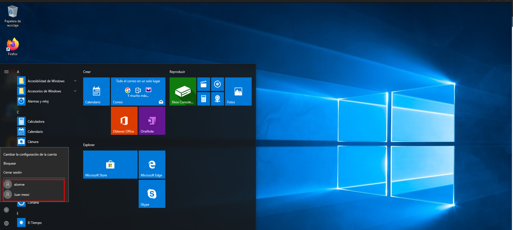

### Permisos

Creem una carpeta ies ebre i per gestionar els permisos accedim a propietats de carpeta.

Accedim a seguretat i a `opcions avanzadas` i `deshabilitem hirencia `que vol dir que Deshabilitar herència atura que la carpeta hereti permisos del directori pare. Això ens permet configurar permisos personalitzats només per a aquesta carpeta.

I esborrem quasi tots menys el administrador i seguidament passem els ppermisos al grup iesbre ja que es l'objectiu de la practica.

Creem un altre grup i posem un usuari que no pertany al ies ebre.
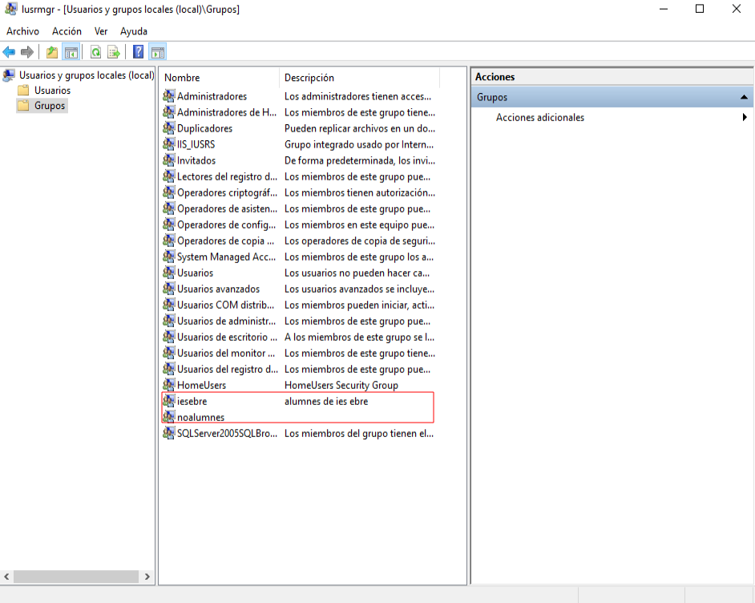

Aa finalment en permisos denegem tot tipus de permisos al grup.
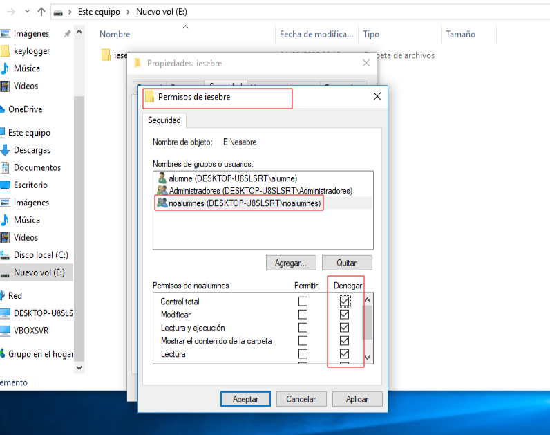

Finalemnt accedim amb el usuari `noalumne` i podem observar que no ens deixa accedir a la carpeta i que no ens deixa crear fitxers.

I si acceidm desde un usuari que pertany al grup iesbre podem observar que ens deixa accedir a la carpeta i que ens deixa crear fitxers.
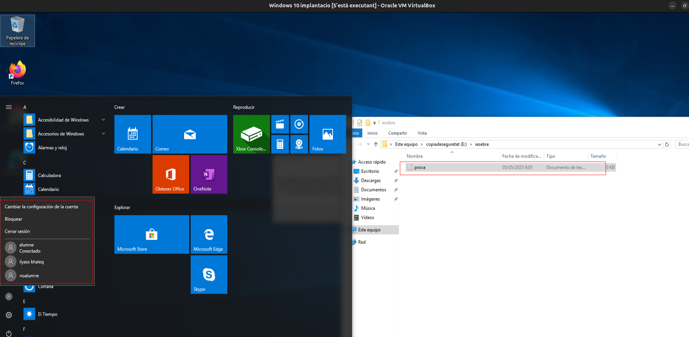

## Sistemes de fitxers i particions
Aquest apartat esta inclos en altres llocs de la practica.

## Còpies de Seguretat i automatizació

## Quotes de disc
En aquset cas crearem un disc de 50gb pero es recomana fer de menys tamañ per fer proves mes exactes.
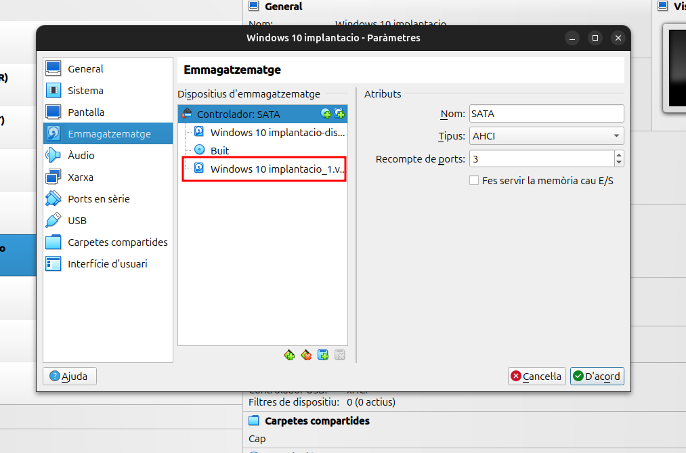

Com hem fet en el anterior crearem les particions i les assignem els següents formats.

I per podem comprovar en el cmd fem la comanda `diskpart` i ens obrira una pantalla de la següent forma, i hem de fer la comanda `list volume` per veure les particions.
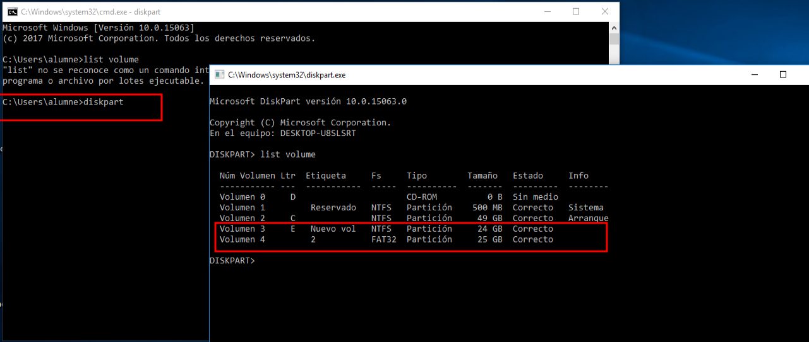

Al fer la partció de formats `NTFS` ens surt a la carpeta de Aquest equip i ja podriem treballar amb la partició.
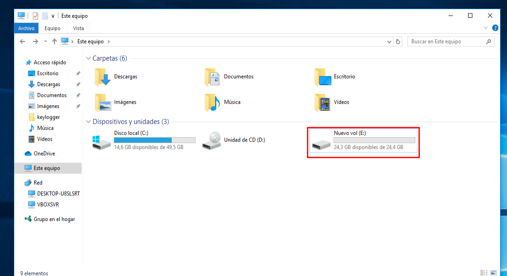

Accedim a les propietats del disc i accedim a `Cuota`.
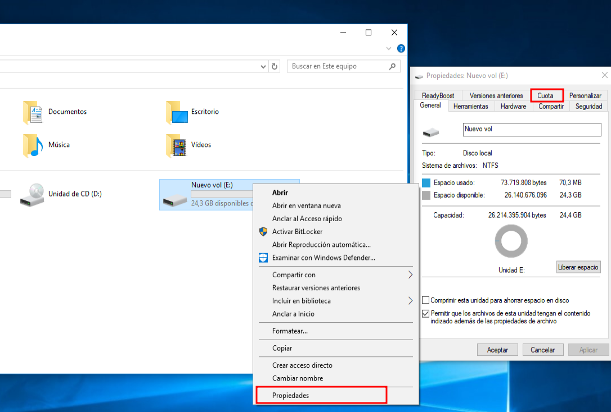

Fem a mostrar la configuració i posem el limit de l'espai i el nivell d'advertencia

Al guardar canvis podem veure que la partció de disc ha sigut modificada i que ens surt que esta activa.
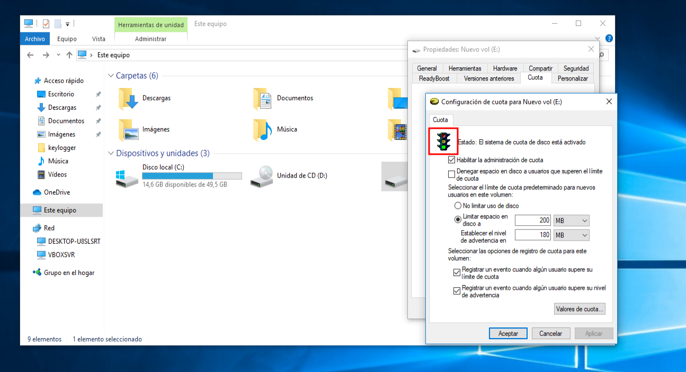

Per fer la prova accedim desde diferents usuari i veiem que ens registra les entrades.
