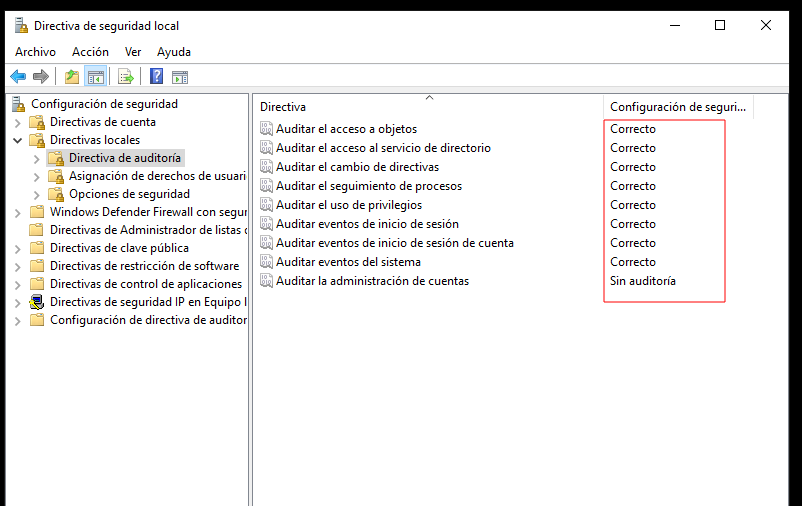
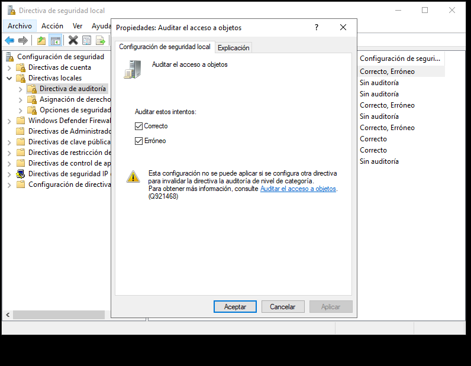
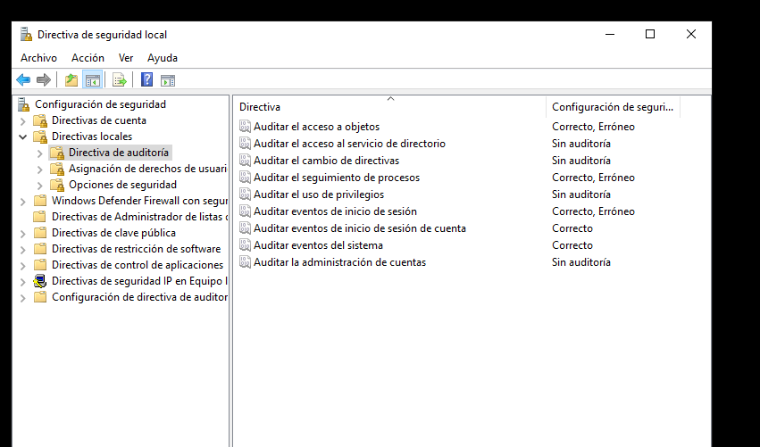
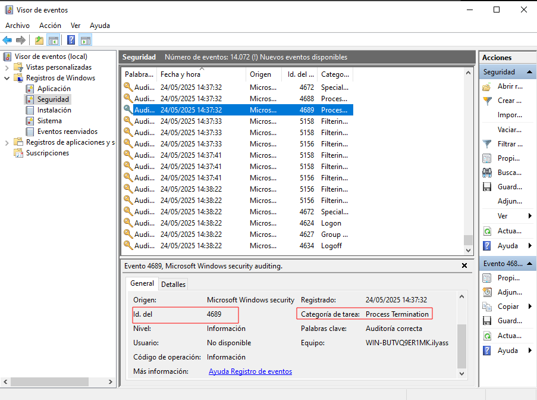
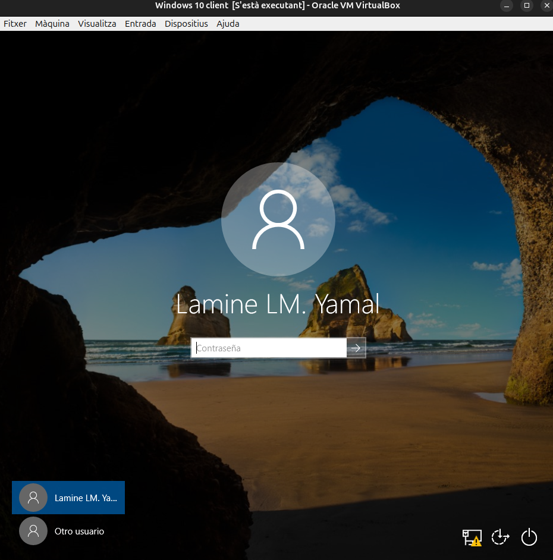
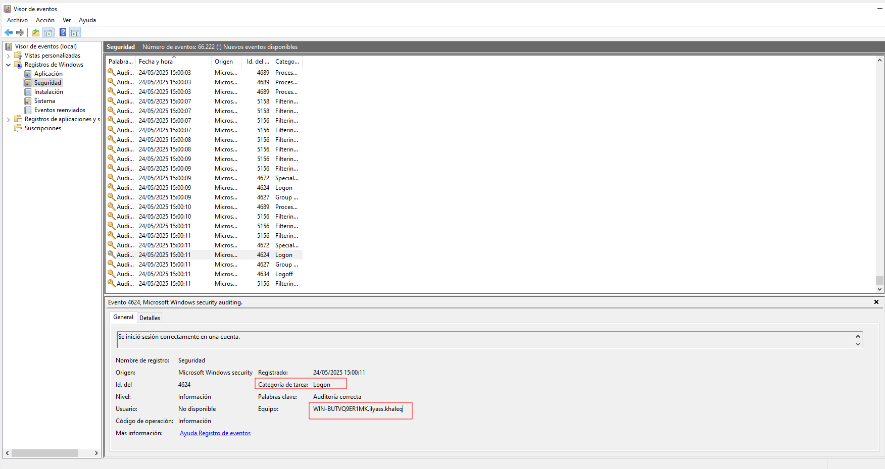
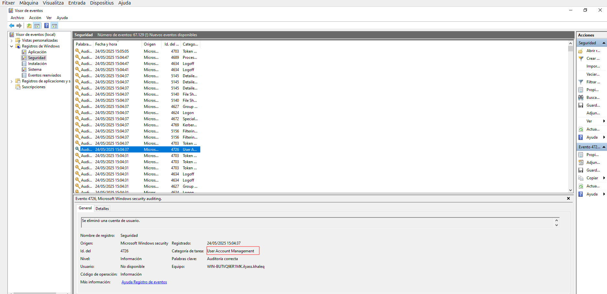

# sprint 5

## Monitorització

### Ús de la CPU

### Informació proporcionada:
- Llista de processos actius i el percentatge de CPU que consumeixen.
- Subprocessos i serveis vinculats a cada procés.
- Dades com el temps de CPU utilitzat, nombre de fils (threads) i l’identificador únic de procés (PID).

### Descripció:
- **CPU (%)**: Reflecteix la quantitat de recursos del processador que utilitza cada procés. Valors elevats (superiors al 80-90%) de manera prolongada poden indicar una anomalia o una càrrega excessiva.
- **PID**: Codi únic que serveix per identificar un procés, útil per a tasques de diagnòstic amb eines com PowerShell o el Visor d’esdeveniments.
- **Nom del procés**: Permet reconèixer aplicacions habituals (com Chrome o Word) o identificar processos sospitosos (per exemple, `svchost.exe` amb comportament estrany).

---

### Ús de Memòria (RAM)

### Informació proporcionada:
- Quantitat de memòria consumida per cada procés.
- Estat de la memòria física (lliure, en ús, en espera, etc.).
- Dades sobre la memòria virtual (swap) i possibles errors d'accés.

### Descripció:
- **Memòria en ús**: Recursos RAM actualment utilitzats per un procés.
- **Memòria en espera**: Dades guardades temporalment que poden ser reutilitzades ràpidament pel sistema.
- **Memòria disponible**: Suma de la memòria lliure i la que està en espera.
- **Memòria virtual**: Combina RAM i disc dur. Un ús excessiu pot indicar que cal més memòria física.

---

### Activitat del Disc

### Informació proporcionada:
- Processos amb operacions de lectura o escriptura al disc.
- Volum de dades llegides o escrites per segon.
- Temps de resposta i latència del dispositiu d’emmagatzematge.
- Fitxers específics en ús.

### Descripció:
- **Lectura/Escriptura (Bytes/s)**: Mostra l’activitat del disc en termes de transferència de dades.
- **Temps de resposta (ms)**: Temps que tarda el disc a gestionar una petició. Valors constants superiors a 20-30 ms poden ser senyal de problemes de rendiment.
- **Cua del disc**: Una cua llarga pot implicar que el disc està saturat i no pot atendre totes les peticions.

---

### Activitat de Xarxa

### Informació proporcionada:
- Aplicacions que envien o reben dades.
- Ports de comunicació i adreces IP remotes.
- Nombre de bytes transmesos i rebuts per segon.

### Descripció:
- **Ús de la xarxa (%)**: Indica el nivell d’ocupació de la connexió.
- **Ports locals/remots**: Es pot veure si una aplicació fa servir ports típics com el 80 (HTTP), 443 (HTTPS), o 21 (FTP).
- **IP remota**: Mostra amb quin servidor es comunica una aplicació.
- **Connexions actives**: Pot ajudar a identificar activitats sospitoses o no autoritzades.

**NO HE FET PART PRACTICA JA QUE ES UN PUNT QUE NO ES DEMANA**

## Auditories

En aquest Sprint aprendrem a implementar una auditoria dins d’un entorn Windows Server i com aquesta afecta les màquines clients. També veurem com fer-ne el seguiment mitjançant eines de monitoratge.

Per habilitar l’auditoria en un sistema Windows, farem servir les **Polítiques de Grup (GPOs)**. La configuració s’inicia accedint a:

Un cop allà, podrem habilitar els paràmetres que volem supervisar.
El pas següent és triar quines accions volem registrar i de quina manera. Podem decidir registrar només els intents fallits, només els exitosos o ambdós.

Un exemple inicial seria activar l’auditoria per a l’**accés a objectes**, que permet detectar quan es consulten, modifiquen o s'eliminen fitxers i altres recursos protegits.
Per tal de tenir una visibilitat completa sobre els esdeveniments del sistema, activarem les opcions més habituals dins del panell de configuració d’auditoria.

Un cop aplicades les polítiques, utilitzarem el **Visor d’Esdeveniments** (Event Viewer) per analitzar els registres. A l’apartat *Seguretat* podrem veure esdeveniments com, per exemple, un procés finalitzat de manera inesperada (ID: `4689`).

Simularem una connexió des de la màquina client amb un usuari real. 

En aquest cas, l’usuari `lAMINE YAMAL` iniciarà sessió, i al servidor apareixerà l'esdeveniment amb l’**ID 4624**, que indica una autenticació satisfactòria.

Com a darrera prova, esborrarem un usuari des de l’Active Directory. En aquest exemple, l’usuari `GAVI` serà eliminat, i l’esdeveniment associat que apareixerà al visor tindrà l’**ID 4726**.

